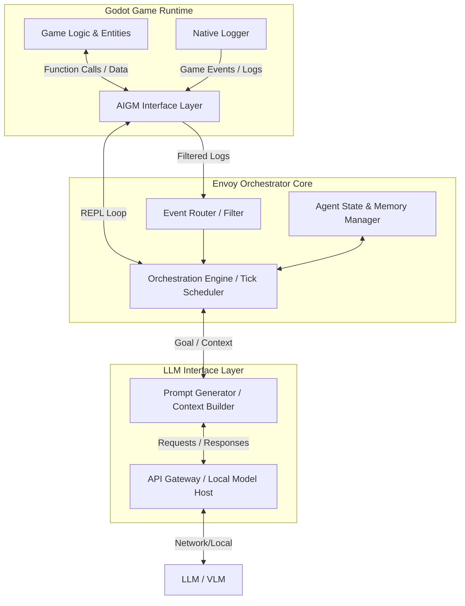

# 项目初衷

备注：项目统一命名为 AIGM。

2. 什么是AIGM？ AIGM 是对 PankuConsole（一个Godot运行时软件）的拓展，简而言之：Panku Console for humans, AIGM for AI.

3. **项目动机**：现在的主流AI辅助游戏开发工具都是静态工具，比如Agent写代码，Agent生成图像，等等，即使将AI加入到运行时，也可能只是简单将AI接入到NPC对话中，对游戏运行的影响有限。AIGM是为了解决什么问题而诞生的？过去的PankuConsole是纯面向人的工具，必须由人去敲指令，去执行，PankuConsole解决了在运行时任意访问游戏代码的能力。现在AIGM将使用大模型Agent来替代PankuConsole中人的角色，进而产生更广阔的应用空间。For example，借助Panku Console的技术积累，Agent将拥有所有重要函数代码的读取和执行权限，并能够捕获到所有的游戏日志，借助这两个关键能力，Agent将可以对运行中的游戏世界产生任意的影响，真正的实现Agent虚拟上帝，为玩家带来无穷无尽的新鲜沉浸式体验。另外，AIGM被设计为可以很轻松的插入到任何Godot项目中，允许游戏开发者轻松的让自己的游戏世界有一种“活过来”的感觉。除了对玩家的帮助之外，在运行时加入一个AI助手，对游戏开发者也是极有帮助的，For example，从今往后，游戏开发的范式将发生变化，gamedev的开发阶段从游戏运行前，转移到游戏运行时，让agent编写新功能，然后利用比如lua之类的语言，进行热重载，直接在游戏运行的时候生成一个新类型的怪物或者NPC。

4. 这个项目将如何开发？
   1. 很显然，人类将不再作为代码的主要编写者和测试者，人类的角色（也就是我，PankuConsole的作者）主要是把握项目的大方向，具体的开发和细节都将由AI来负责。因此务必保证AI能够自己执行代码，并获得反馈。而不是AI写完了，人类再打开程序，发现报错，把报错描述给AI，AI再去修改，这样的流程效率是极其低下的。
   2. 考虑到历史遗留，AIGM将在继承PankuConsole的设计思想上，作为一个全新的项目开发，侧重点是为Agent提供全面的接口，纯文本的接口，而不再是人机接口、UI界面接口。PankuConsole作为历史遗产，将提供宝贵的REPL经验。
   3. Agent能力是重点，现在有各种各样的Agent，比如编程Agent、个人助手Agent，模式都是Agent先接受任务，然后再去执行。游戏Runtime Agent，该如何设计，要达成什么样的目的，适用于什么样的场景，将是AIGM的核心功能考虑点。

5. 项目展望：不只是Godot的一个普通插件，不只是让Panku Console在AI时代“焕发第二春”，大模型现在在游戏行业应用的痛点是“有脑无手”，如果这个项目做的好的话，将成为一种新的范式，一种真正意义上的、通用的AI Agent游戏交互框架（先画个大饼，鼓励一下自己开发）。

6. 我能想到的可能的应用场景，实际场景是无限的。
   1. AI游戏导演，类似求生之路的Director AI，Agent在后台监视玩家的行为和状态，通过控制台去生成怪物、改变天气、触发随机时间等，来让玩家保持紧张感。
   2. NPC不再是预设的对白机器，他是真的知道游戏世界发生了什么，玩家做了什么（但会根据自己的身份和状态选择性知道），比如玩家偷了村长家的鸡，Agent知道NPC看到这个事件之后，会让NPC执行一些反馈动作，比如咒骂玩家，拿石头扔玩家等。NPC Reaction Engine.
   3. 自动化QA，开发者让Agent去测试关卡有没有碰撞漏洞，Agent控制角色在场景里乱跑等，或者疯狂测试各种极端场景、参数，触发报错之后，自动总结反馈。
   4. 自然语言编程。开发者不再需要硬编码各种规则，只需要用自然语言描述各种情况，比如，玩家靠近悬崖，让风声变化，并让角色有一定几率滑倒，等。游戏运行时，Agent动态接管这部分逻辑的执行。

7. 可能的难点和坑点。
   1. 如何接入各种各样的大模型API？我打算用gdscript来编写整个脚本，以实现最大程度的通用性。或者LUA？这样更方便捕捉报错，也许更方便AI闭环开发测试？
   2. Agent的编排流程怎么写？什么时候给大模型发消息？Agent行动的频率是啥样的？
   3. 安全？不考虑这个，怎么方便怎么来，毕竟是游戏，还是运行时的，又不是生产环境，没必要太考虑安全问题，别把玩家的存档搞坏就行，游戏开发者自己为给AI提供的接口安全性兜底。

8. 具体的功能模块？
    1. 通过Godot的接口，获取用户的接口（用户应该可以给关键的函数加上注解之类的东西吧），生成游戏的接口文档。
    2. Log接口，允许打各种标签的日志，Agent看不到游戏画面，但可以通过日志来知道游戏发生了什么。
    3. Agent REPL接口，形成一个Loop，Agent通过REPL执行命令，REPL给出输出，如此循环。
    4. Agent模块。

9. 我的AIGM和把PankuConsole包装成MCP服务再加上外部通用的Agent大脑，有什么区别，核心优势？我想，应该是Agent虚拟上帝大脑吧，我不止是一个API搬运工（PankuConsole），我更是一个连续运作的大脑。通常的Agent是回合制，用户输入->大模型思考->给出结果。但是游戏世界是持续流动的，玩家所有向大模型的输入都体现在游戏行为里。Agent必须有时间的概念。通用Agent很容易被游戏里的海量日志所淹没，导致Token爆炸，AIGM应该有一个针对游戏环境的感知过滤器，开发者不必精心挑选哪些日志要送到Agent那里去，而是AIGM自动区分重要信息总结，有重要变化时，主动发起Agent调用。另外，AIGM允许多个Agent并行执行，可以分别负责这个游戏世界不同的信息处理部分。总之，针对高度动态的游戏运行环境定制的Agent编排流程，将是我的工具的护城河和不可替代性。


# 01_architecture_overview

## 1. 核心定位与设计哲学

AIGM 的核心定位是：**深度集成于 Godot 运行时的智能 Agent 交互框架**。

### 1.1 区别于传统 MCP (Model Context Protocol) + 外部通用 Agent
这是 AIGM 护城河与核心竞争力的所在。
* **通用 MCP + 外部 Agent 的局限性**：
  * **非实时性**：外部 Agent 通常是基于 Request-Response 的离线思维模式，对游戏这种高频 Tick、实时变化的环境缺乏感知。
  * **上下文断裂**：外部 Agent 难以持续跟踪游戏内庞大且动态的 Entity 状态，每次交互都需要传递大量冗余状态。
  * **缺乏主动性**：通常只能被动响应玩家输入，难以承担“游戏导演”或“世界观测者”的主动角色。
* **AIGM 的优势 (Runtime-Native Agent)**：
  * **原生运行时感知**：Agent 编排流程直接寄宿在游戏引擎或与之紧密相连，能够精确捕获引擎级事件（Event）和日志（Log）。
  * **主动介入流 (Proactive Flow)**：Agent 不仅仅是聊天机器人，它可以根据游戏内的阈值或事件（如玩家血量低下、到达特定区域）主动唤醒并执行 REPL 命令干预游戏。
  * **状态连续性**：Agent 可以维持持久化的记忆和内部状态机，与游戏生命周期绑定。

## 2. 宏观系统架构

AIGM 在逻辑上分为四个主要层级：



### 2.1 Godot 接口层 (Godot Interface Layer)
继承自 PankuConsole 的遗产，但为机器（Agent）深度优化：
* **API Exporter**：通过注解或反射，将游戏内关键函数和变量暴露为扁平化的、文本友好的接口。
* **Log Streamer**：结构化日志输出（如 JSON 格式），为日志打上 Tag（如 `[Combat]`, `[Player_Movement]`），方便 Agent 过滤和理解。
* **REPL Executor**：Agent 执行命令的沙盒环境（GDScript 或 Lua 解释器），负责捕获执行结果和 Error，并返回给 Agent。

### 2.2 编排核心层 (Envoy Orchestrator Core)
*AIGM 的灵魂所在，决定了 Agent 如何在游戏世界中生存。*
* **Tick Scheduler**：为 Agent 分配运行周期（如每 5 秒一次宏观决策 Tick）。
* **Event Router**：过滤海量的游戏日志，只有触发了设定的模式或关键字，才唤醒或中断 Agent。
* **State Manager**：维护 Agent 的工作状态（如：Idling, Planning, Executing, Waiting_for_REPL_Result）。

### 2.3 LLM 交互层 (LLM Interface Layer)
* **Context Builder**：动态组装 Prompt。由于游戏状态过大，Agent 需要先通过 REPL 查询感兴趣的状态，然后 Builder 将这些查询结果注入到 Prompt 中。
* **Tool Call Parser**：将 LLM 输出的通用文本或函数调用，解析为 Godot 环境下可执行的 REPL 语句。

## 3. 开发阶段规划

* **Phase 1: 基础设施 (Infrastructure)**
  * 搭建基础的纯文本 REPL 执行环境（无 UI，支持 GDScript 动态执行并安全捕获异常）。
  * 实现 Godot 内部日志的结构化捕获与导出。
* **Phase 2: 单个 Agent 闭环 (The First Loop)**
  * 接入 LLM API。
  * 实现基础的 Prompt 构建，让 Agent 能够看懂日志，并输出 REPL 命令，再将 REPL 结果喂回给 Agent。
* **Phase 3: 复杂编排 (Advanced Orchestration)**
  * 实现 Tick 机制和事件唤醒机制。
  * 支持多 Agent 协同（如：一个观测者 Agent 负责总结日志，一个决策 Agent 负责执行命令）。
* **Phase 4: 开发者套件 (Developer Kit)**
  * 提供友好的 Godot 节点或资源配置界面，让游戏开发者可以轻松地将 AIGM 拖入项目，配置 API 密钥和暴露的接口。

# 02_agent_orchestration

## 1. 为什么游戏环境需要特殊的编排？

传统的通用 Agent（例如使用 LangChain 或 AutoGen 构建的 Agent）通常是线性的、任务驱动的（Task-driven）：
`接受用户输入 -> 思考 -> 使用工具 -> 得到结果 -> 返回给用户`。

在游戏这种 **实时（Real-time）、状态密集（State-heavy）、高频变化（High-frequency）** 的环境中，线性编排会面临致命问题：
1. **世界不会等待 Agent**：当 Agent 正在思考（通常需要几秒钟）时，游戏内的状态已经发生了翻天覆地的变化。
2. **上下文过载**：游戏每帧产生的数据量极大，不可能将整个世界状态塞入 Prompt。
3. **缺乏主动性机制**：传统 Agent 是被动触发的，而“游戏导演”或“高阶 NPC”需要主动观察并采取行动。

因此，AIGM 的编排流程必须是 **异步的、事件与时间混合驱动的、且高度依赖短反馈 REPL 循环** 的。

## 2. AIGM 核心编排模型：混合驱动状态机

我们将 Agent 的生命周期建模为一个持续运行的状态机（State Machine），由两种核心机制驱动：

### 2.1 事件驱动唤醒 (Event-Driven Wakeup)
游戏通过 `Log Streamer` 持续输出结构化日志。编排器会维护一个**感知缓冲区 (Perception Buffer)**。
* **机制**：当出现特定级别的日志（如 `[Critial] Player HP < 10%` 或 `[Event] Player entered Boss Room`）时，立即中断 Agent 当前的挂起状态，强制将其唤醒进行评估。
* **应用场景**：NPC 的应激反应（玩家攻击 NPC）、导演系统的紧急干预。

### 2.2 时钟轮询 (Tick Polling)
* **机制**：不同于游戏的 60 FPS，Agent 有自己的“心智时钟（Mind Tick）”，例如 1 Tick = 5 秒。每个 Tick，Agent 会主动苏醒，查看过去 5 秒内的核心日志摘要（由底层的轻量级模块归纳），决定是否需要发起新的行动。
* **应用场景**：AI 导演定期检查游戏节奏、自动 QA Agent 决定下一步去测试地图的哪个区域。

## 3. 核心编排流程闭环 (The Orchestration Loop)

当 Agent 被触发（无论是事件还是 Tick）时，它会进入以下闭环：

```text
[感知 Perception] --> [评估 Evaluation] --> [规划 Planning] --> [执行 Execution (REPL)] --> [验证 Validation]
```

### 3.1 感知阶段 (Perception)
* **输入**：积压在感知缓冲区的游戏日志（过去 N 秒内发生的关键事件）。
* **动作**：Agent 阅读日志。如果信息不足（例如：“玩家受伤了”，但 Agent 不知道玩家在哪个房间），Agent 会**主动使用 REPL 查询工具**。
* *REPL 示例*：`envoy.get_player_room()` 

### 3.2 评估与规划 (Evaluation & Planning)
* **动作**：基于感知到的上下文，决定是否需要干预游戏。如果需要，生成一系列的目标（Goals）。
* *内部思考示例*：“玩家在熔岩区，且血量极低。为了保持紧张感但不致死，我应该停止生成怪物，并可能在前方掉落一个血包。”

### 3.3 异步执行阶段 (Asynchronous Execution)
这是与通用 Agent 最大的区别。LLM 生成代码或命令后，注入到 Godot 中执行。
* **痛点解决**：因为 LLM 延迟高，生成的代码必须是**能在游戏内自治运行的脚本**。
* **机制**：Agent 不应该逐帧控制怪物，而是通过 REPL 发送高层级的逻辑。
* *REPL 示例*：`envoy.spawn_entity("health_pack", envoy.get_player_pos() + Vector3(0, 0, 5))`

### 3.4 验证阶段 (Validation)
* **动作**：执行完 REPL 命令后，编排器会立即捕获返回值和错误（Error）。
* **自愈机制**：如果 GDScript/Lua 执行抛出异常，错误信息会立刻喂给 Agent，触发一轮快速的自我修复。这极大降低了开发者的 Debug 成本。

## 4. 架构设计上的护城河

为什么 **AIGM = MCP + 外挂 Agent** 是错误的等式？

1. **内嵌式记忆 (Embedded Memory)**：Envoy 知道哪些 Godot 对象句柄 (Object IDs) 正在活跃，Agent 可以直接传递对象引用给引擎，而不需要序列化成 JSON 通过网络层传递给外部 MCP。
2. **零延迟的沙盒 (Zero-latency Sandbox)**：REPL 的执行在引擎内部完成，错误捕获是帧级别的。
3. **时空同步**：Envoy 可以随时调用 `Engine.time_scale = 0.0` 暂停游戏时间，等大模型思考完毕后再恢复，这是外部 MCP 无法优雅做到的。

## 5. 下一步开发建议

在代码层面实现编排器时，我们需要：
1. **一个健壮的任务队列系统**：管理 Agent 的并发思考。
2. **Prompt 模板的模块化**：针对不同的唤醒源（Tick vs Event），向 LLM 发送不同的 System Prompt。
3. **上下文滑动窗口**：控制喂给大模型的日志数量，防止 Token 爆炸。

# 03_interface_and_sandbox

## 1. 运行时接口的核心需求

为了实现高度智能的 Agent 编排，AIGM 必须为大模型提供一套极简且强健的底层接口。与 PankuConsole 面向人类的 UI 界面不同，这里的接口**必须是纯文本的、上下文紧凑的、且容错率高的**。

### 1.1 面向 Agent 的代码沙盒 (The REPL Sandbox)
Agent 需要能够执行任意游戏逻辑（修改变量、调用函数、生成实体）。
为了避免 Agent 瞎写代码导致整个 Godot 引擎崩溃，我们需要一个沙盒（Sandbox）环境。

#### 方案比较与选择
*   **GDScript 动态执行 (Expression/Script.new())**：
    *   *优势*：原汁原味，与引擎无缝融合。
    *   *劣势*：容错性差。一旦 Agent 写出死循环，引擎可能直接卡死（除非有看门狗机制）。运行时编译新脚本会有一定开销。
*   **Lua 沙盒 (通过 Lua 绑定插件)**：
    *   *优势*：极度安全。Lua 虚拟机可以被轻松重置，死循环可以被指令计数器中断。热重载体验极佳，且非常适合写短小的脚本（游戏行业标准）。
    *   *劣势*：需要引入额外的绑定层，增加复杂度。

**结论**：在早期验证阶段，我们可以优先使用 PankuConsole 积累的 **GDScript 表达式求值 (Expression/gdexprenv)** 经验，提供基础的 REPL。但在未来高强度的 Agent 闭环开发测试（如自动化 QA 场景）中，引入 **安全的 Lua 沙盒** 将是一个强有力的卖点。

## 2. 三大核心接口 (The Three Pillars)

### 2.1 游戏状态的快照与查询 (State Querying)
Agent 必须能在感知阶段（Perception）迅速搞清状况。
*   **机制**：不要强推全量状态给 Agent！而是让 Agent 像使用 `SQL` 一样去查询游戏。
*   **注解/暴露 API**：游戏开发者可以通过在节点属性或方法前添加特定前缀（如 `@envoy_export`，但在 Godot 4 中可能需要通过特定的 Register 方法实现），将这部分状态暴露给沙盒环境。
*   *示例命令*：
    ```gdscript
    # Agent 发现玩家血量低，主动查询玩家背包是否有回血道具
    > envoy.player.inventory.count("health_potion")
    < 0
    ```

### 2.2 结构化日志引擎 (Structured Log Engine)
这是唤醒 Agent 的关键输入源（Event-Driven Wakeup）。
*   **机制**：除了普通的 `print`，AIGM 提供一套带语义标签（Semantic Tags）的日志系统。
*   *开发者调用*：
    ```gdscript
    EnvoyLogger.warn("[Combat] Player received 50 damage from Boss_01.", {"hp": 10, "pos": Vector3(...)})
    ```
*   **处理流程**：日志不仅显示在控制台，还会被转换为 JSON 或简化的 Markdown 格式送入**感知缓冲区**。Agent 可以根据 Tag（如只订阅 `[Combat]` 和 `[Quest]`）来决定是否忽略这条日志。

### 2.3 干预执行管道 (Intervention Pipeline)
当 Agent 决定改变游戏时，它通过执行代码进行干预。
*   **机制**：所有的执行操作必须返回明确的成功或失败状态，以及详细的 Error Trace。
*   **自修复闭环 (Self-Healing Loop)**：
    *   如果 Agent 执行：`envoy.spawn_monster("goblin", "invalid_pos")`
    *   引擎抛出异常。Envoy 捕获该异常，并将 Error 直接塞入下一个 Prompt：`"上次执行失败：TypeError - expected Vector3 for argument 2."`
    *   Agent 收到错误，立即生成修正后的代码并再次尝试。

## 3. 安全性与访问控制

正如 README 中提到的，**对于游戏运行时，安全性并非首要考虑因素，开发者自己为暴露给 AI 的接口兜底**。
*   **原则**：我们相信开发者知道他们在做什么。
*   **底线防护**：只需确保 Agent 无法随意读写玩家机器上的任意本地文件（除规定的存档/日志目录外），以及防止危险的网络请求。对于内存中的游戏对象，Agent 可以任意折腾。

## 4. 总结：这为什么比 MCP 更好？

在 MCP 模型中，外部 Agent 会调用 `call_tool("spawn_monster", {"type": "goblin", "pos": [1,2,3]})`。如果 Godot 不在运行，或者当前场景不对，调用就会失败且丢失上下文。

而在 AIGM 的设计中，Agent **“生活”** 在游戏里。它不需要通过僵硬的工具定义（Tool Definitions）来约束自己。它只需要知道 Godot 的 API 规范，然后利用强大的 REPL 沙盒，去探索、组合、执行那些连开发者都没有预料到的骚操作。这就是**虚拟上帝**的真正含义。
